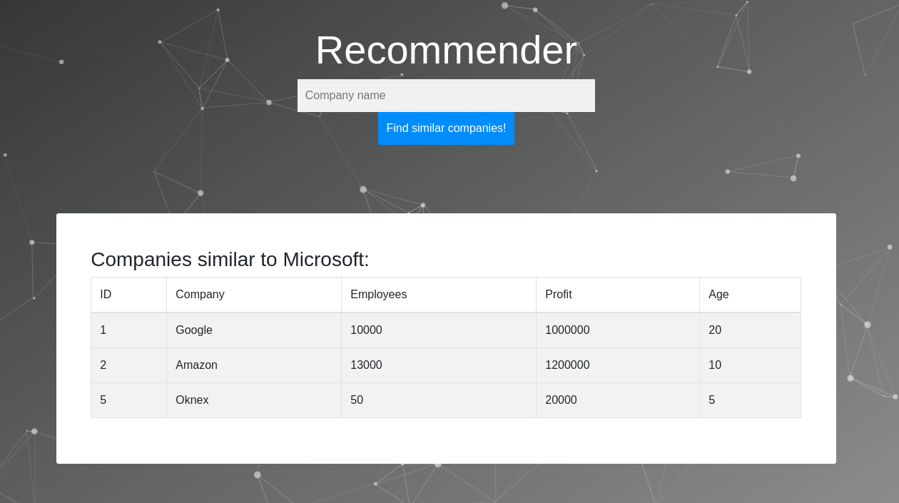

# Recommender

## Environment setup
1. Build docker image:  
`make build`
This command will build a docker image named 'recommender' which all the specified dependencies.

### Usage
For convenience we use Makefile with common commands but you can start and interact with docker containers manually if you wish.  

1. Execute the following command to start the container.  
`make dev`  
It will start a docker container with default parameters. Your current working directory will be mounted to a '/project' directory inside the container. Additionally you can specify another mounting path to a volume containing required datasets etc.

### Jupyter lab
From within container run:  
`make lab`
Jupyter lab can be useful when developing on remote machines.

### Starting the app:
From withing the container run:  
`python3 app/app.py`

Application will be available from your browser at:  
`http://127.0.0.1:8888/`
